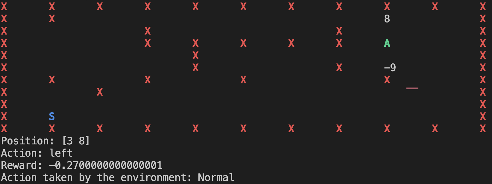
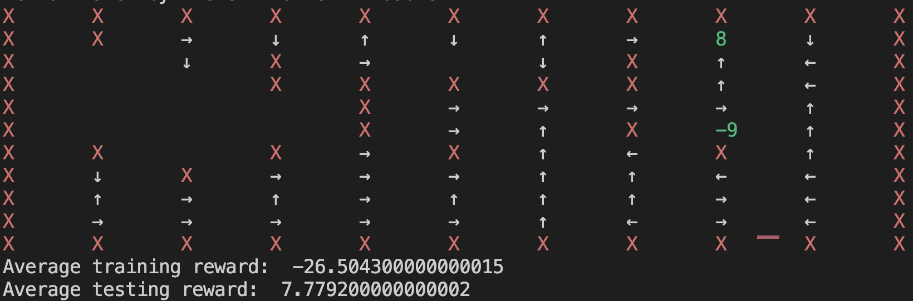
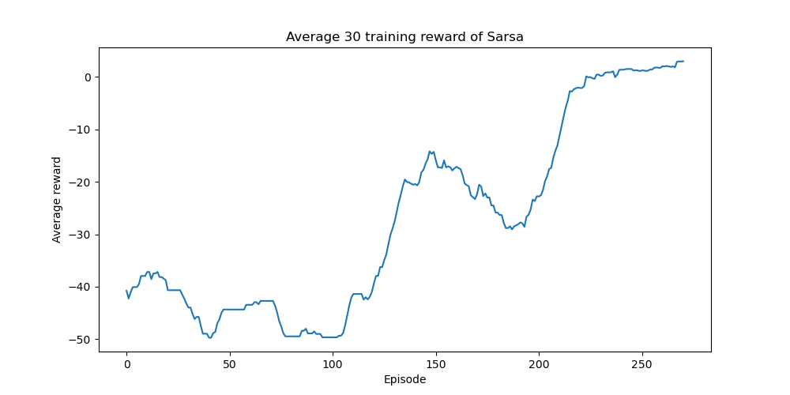

# Gridworld

Yes, this is RL stuff. Ripoff frozen lake

## How to run this?

### Requirements
Make sure that you have `gym >= 0.25.2`, [`matplotlib` (plot outside) or `plotext` (plot inside terminal)] and `numpy` installed. To use `plotext` use tag `-plotext True`, if not, matplotlib will be used as a default option.

### Getting Start
Start from the helping function
```
python TDEnv.py --help
```
### Environment Customization
You can set the customized reward with tag `--r <your_reward>`. Note that you need negative sign for penalty. You can also customize the probabilistic aspect of moving by using tag `-p`. The larger the `p`, the more likely the agent will moves as intended.

### Testing
If you have your grid file (tab delimited text file) where 0 means empty, [-9,9] \ {0} means reward, S means start, and X means wall. Then, you can run 
```
python TDEnv.py --gridfile <your_file> <human|random|sarsa|q>
```
for running this.

### Randomize your board
If you want to create a random board, you can customize the board with the following tags and commands
```
python TDEnv.py --seed <seed> --size <size> -pW <wall_prob> -nrP <num_pos_reward> -nrN <num_neg_reward> -nWh <num_wormhole_pairs> <human|random|sarsa|q>
```
You can set the random seed, the size of the board, the probability of having a wall in any spot, how many positive reward, how many negative reward, and how many wormholes pairs.

### Training Customization
There are some customization on training, this includes the parameters like alpha and gamma, the epsilon decay, number of runs for finding Q, number of moves to terminated, etc. Please use the helping function for more details.

## Output?

The following test is generated by
```
python TDEnv.py --size 10 --seed 5951 --r -0.01 -alpha 0.5 -gamma 0.9 -nrP 1 -nrN 1 -p 0.7 -pW 0.2 -start_eps 0.5 -end_eps 0 -nEp 300 -epsDecay True sarsa
```
This is the output for a run

There are 5 outputs: 
  * The board itself (rendered) with "A" representing the current position of Agent and "S" for starting point.
  * Current Position as a list of row and column (start from 0)
  * Action performed
  * Total reward from this episode
  * The action that we end up doing (like normal, double, or backward)

Then, after the training is done and the example run is also done, the policy will be generated 

The arrow representing the action that the agent should do given that state. Then, we will have the average training (over all training episodes) and average testing reward.

Lastly, there will be a plot of average of every 30 episodic rewards generated.

